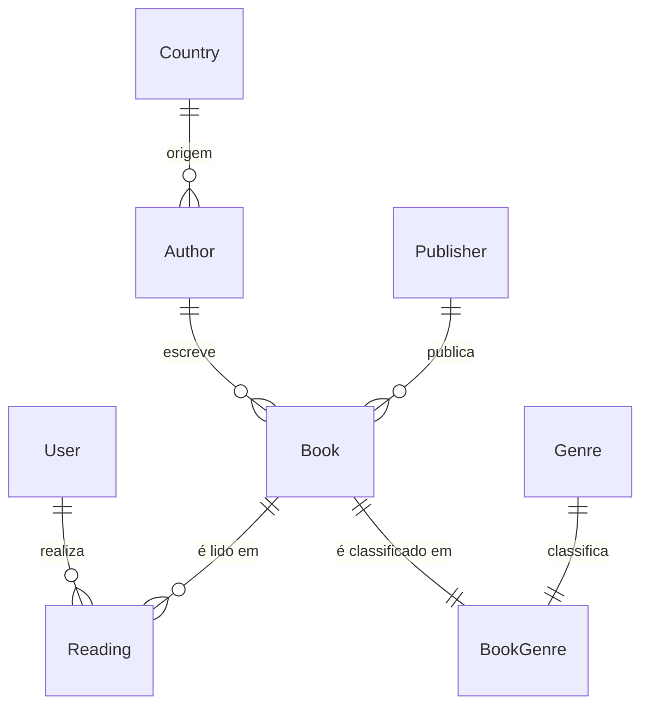

## 🧩 Modelo de dados final (Identity + tabelas normalizadas)

### **User**

| Campo       | Tipo          | Descrição                       |
| ----------- | ------------- | ------------------------------- |
| Id          | string        | Identificador (Identity PK)     |
| UserName    | nvarchar(256) | Nome de login                   |
| Email       | nvarchar(256) | Email do usuário                |
| DisplayName | nvarchar(50)  | Nome visível ("Heitor", "Gaby") |

```csharp
public class UserModel : IdentityUser<string>
{
    [Required, MaxLength(50)]
    public string DisplayName { get; set; } = string.Empty;

    public ICollection<ReadingModel> Readings { get; set; } = new List<ReadingModel>();
}
```

---

### **Country**

| Campo | Tipo         | Descrição                        |
| ----- | ------------ | -------------------------------- |
| Id    | int          | Identificador                    |
| Name  | nvarchar(50) | Nome do país                     |
| Code  | char(3)      | Sigla ISO-3 (“BRA”, “USA”, etc.) |

```csharp
public class Country
{
    [Key] public int Id { get; set; }

    [Required, MaxLength(50)] public string Name { get; set; } = string.Empty;
    [Required, StringLength(3)] public string Code { get; set; } = string.Empty;

    public ICollection<Author> Authors { get; set; } = new List<Author>();
}
```

---

### **Author**

| Campo     | Tipo          | Descrição     |
| --------- | ------------- | ------------- |
| Id        | int           | Identificador |
| Name      | nvarchar(100) | Nome do autor |
| CountryId | int?          | FK → Country  |
| Gender    | char(1)       | "F" ou "M"    |

```csharp
public class AuthorModel
{
    [Key] public int Id { get; set; }

    [Required, MaxLength(100)] public string Name { get; set; } = string.Empty;
    public int? CountryId { get; set; }
    [Required, Column(TypeName = "char(1)")] public char Gender { get; set; }

    [ForeignKey(nameof(CountryId))] public CountryModel? Country { get; set; }
    public ICollection<BookModel> Books { get; set; } = new List<BookModel>();
}
```

---

### **Publisher**

| Campo | Tipo          | Descrição       |
| ----- | ------------- | --------------- |
| Id    | int           | Identificador   |
| Name  | nvarchar(100) | Nome da editora |

```csharp
public class Publisher
{
    [Key] public int Id { get; set; }
    [Required, MaxLength(100)] public string Name { get; set; } = string.Empty;

    public ICollection<Book> Books { get; set; } = new List<Book>();
}
```

---

### **Genre**

| Campo | Tipo         | Descrição                                  |
| ----- | ------------ | ------------------------------------------ |
| Id    | int          | Identificador                              |
| Name  | nvarchar(50) | Nome do gênero (“Romance”, “Ficção”, etc.) |

```csharp
[Index(nameof(Name), IsUnique = true)]
public class GenreModel
{
    [Key] public int Id { get; set; }
    [Required, MaxLength(50)] public string Name { get; set; } = string.Empty;

    // Relacionamento muitos-para-muitos com Book
    public ICollection<BookGenreModel> BookGenres { get; set; } = new List<BookGenreModel>();
}
```

---

### **BookGenre**

| Campo   | Tipo | Descrição     |
| ------- | ---- | ------------- |
| Id      | int  | Identificador |
| BookId  | int  | FK → Book     |
| GenreId | int  | FK → Genre    |

```csharp
public class BookGenreModel
{
    [Key] public int Id { get; set; }
    [Required] public int BookId { get; set; }
    [Required] public int GenreId { get; set; }

    [ForeignKey(nameof(BookId))] public BookModel Book { get; set; } = null!;
    [ForeignKey(nameof(GenreId))] public GenreModel Genre { get; set; } = null!;
}
```

---

| Campo           | Tipo          | Descrição          |
| --------------- | ------------- | ------------------ |
| Id              | int           | Identificador      |
| Title           | nvarchar(200) | Título             |
| AuthorId        | int           | FK → Author        |
| PublisherId     | int?          | FK → Publisher     |
| PageCount       | int           | Número de páginas  |
| PublicationDate | date          | Data de publicação |

```csharp
public class BookModel
{
    [Key] public int Id { get; set; }

    [Required, MaxLength(200)] public string Title { get; set; } = string.Empty;
    [Required] public int AuthorId { get; set; }
    public int? PublisherId { get; set; }
    [Range(1, 10000)] public int PageCount { get; set; }
    [DataType(DataType.Date)] public DateTime? PublicationDate { get; set; }

    [ForeignKey(nameof(AuthorId))] public AuthorModel Author { get; set; } = null!;
    [ForeignKey(nameof(PublisherId))] public PublisherModel? Publisher { get; set; }

    // Relacionamento muitos-para-muitos com Genre
    public ICollection<BookGenreModel> BookGenres { get; set; } = new List<BookGenreModel>();
    public ICollection<ReadingModel> Readings { get; set; } = new List<ReadingModel>();
}
```

---

### **Reading**

| Campo     | Tipo         | Descrição                     |
| --------- | ------------ | ----------------------------- |
| Id        | int          | Identificador                 |
| BookId    | int          | FK → Book                     |
| UserId    | string       | FK → User                     |
| Year      | int?         | Ano da leitura                |
| Month     | int?         | Mês numérico (1–12)           |
| Rating    | int?         | Nota (0-5)                    |
| StartDate | date         | Data de início                |
| EndDate   | date?        | Data de término               |
| Status    | nvarchar(20) | Status ("Em progresso", etc.) |
| PagesRead | int          | Páginas lidas                 |

```csharp
public class ReadingModel
{
    [Key] public int Id { get; set; }

    [Required] public int BookId { get; set; }
    [Required] public string UserId { get; set; }

    public int? Year { get; set; }
    [Range(1, 12)] public int? Month { get; set; }
    [Range(0, 5)] public int? Rating { get; set; }

    [DataType(DataType.Date)] public DateTime? StartDate { get; set; }
    [DataType(DataType.Date)] public DateTime? EndDate { get; set; }
    [MaxLength(20)] public string Status { get; set; } = "Em progresso";
    [Range(0, 10000)] public int PagesRead { get; set; }

    [ForeignKey(nameof(BookId))] public BookModel Book { get; set; } = null!;
    [ForeignKey(nameof(UserId))] public UserModel User { get; set; } = null!;
}
```

---

### **Diagrama ER**



---

### OnDelete Cascade

| Relação               | Tipo | `OnDelete` | Justificativa                                                                                                  |
| --------------------- | ---- | ---------- | -------------------------------------------------------------------------------------------------------------- |
| **User → Reading**    | 1:N  | `Restrict` | Se o usuário for apagado, **preserve as leituras** (histórico). Você pode bloquear deleção se houver leituras. |
| **Book → Reading**    | 1:N  | `Cascade`  | Se um livro for apagado, **apague as leituras** associadas (porque a leitura depende diretamente do livro).    |
| **Author → Book**     | 1:N  | `Restrict` | Impede apagar um autor que tenha livros vinculados. Garante integridade e evita cascade acidental.             |
| **Country → Author**  | 1:N  | `SetNull`  | Se um país for removido, mantenha o autor e apenas limpe `CountryId` (autores “sem país”).                     |
| **Publisher → Book**  | 1:N  | `SetNull`  | Se a editora for excluída, o livro continua existindo sem referência à editora.                                |
| **Genre → BookGenre** | 1:N  | `Cascade`  | Se um gênero for removido, remova as associações BookGenre.                                                    |
| **Book → BookGenre**  | 1:N  | `Cascade`  | Se um livro for removido, remova as associações BookGenre.                                                     |
