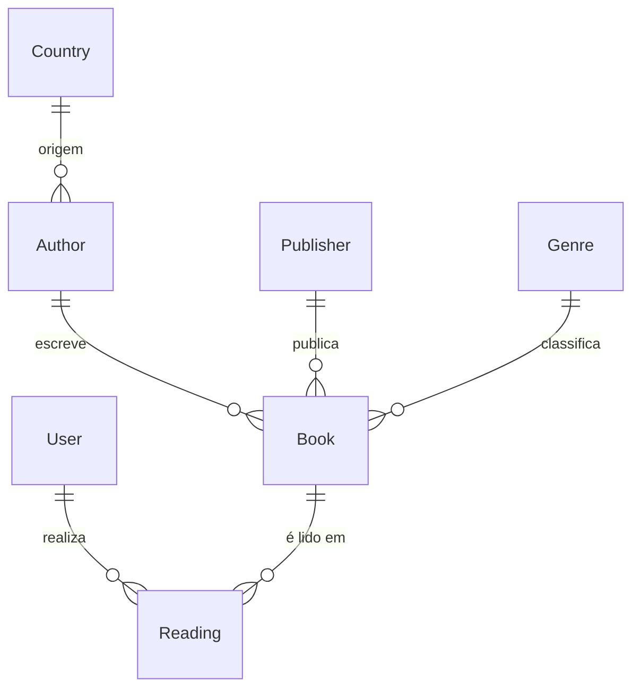

## 🧩 Modelo de dados final (Identity + tabelas normalizadas)

### **User**

| Campo       | Tipo          | Descrição                       |
| ----------- | ------------- | ------------------------------- |
| Id          | int           | Identificador (Identity PK)     |
| UserName    | nvarchar(256) | Nome de login                   |
| Email       | nvarchar(256) | Email do usuário                |
| DisplayName | nvarchar(50)  | Nome visível (“Heitor”, “Gaby”) |

```csharp
public class User : IdentityUser<int>
{
    [Required, MaxLength(50)]
    public string DisplayName { get; set; } = string.Empty;

    public ICollection<Reading> Readings { get; set; } = new List<Reading>();
}
```

---

### **Country**

| Campo | Tipo         | Descrição                        |
| ----- | ------------ | -------------------------------- |
| Id    | int          | Identificador                    |
| Name  | nvarchar(50) | Nome do país                     |
| Code  | char(3)      | Sigla ISO-3 (“BRA”, “USA”, etc.) |

```csharp
public class Country
{
    [Key] public int Id { get; set; }

    [Required, MaxLength(50)] public string Name { get; set; } = string.Empty;
    [Required, StringLength(3)] public string Code { get; set; } = string.Empty;

    public ICollection<Author> Authors { get; set; } = new List<Author>();
}
```

---

### **Author**

| Campo     | Tipo          | Descrição     |
| --------- | ------------- | ------------- |
| Id        | int           | Identificador |
| Name      | nvarchar(100) | Nome do autor |
| CountryId | int           | FK → Country  |
| Gender    | char(1)       | “F” ou “M”    |

```csharp
public class Author
{
    [Key] public int Id { get; set; }

    [Required, MaxLength(100)] public string Name { get; set; } = string.Empty;
    [Required] public int CountryId { get; set; }
    [Required, Column(TypeName = "char(1)")] public char Gender { get; set; }

    [ForeignKey(nameof(CountryId))] public Country Country { get; set; } = null!;
    public ICollection<Book> Books { get; set; } = new List<Book>();
}
```

---

### **Publisher**

| Campo | Tipo          | Descrição       |
| ----- | ------------- | --------------- |
| Id    | int           | Identificador   |
| Name  | nvarchar(100) | Nome da editora |

```csharp
public class Publisher
{
    [Key] public int Id { get; set; }
    [Required, MaxLength(100)] public string Name { get; set; } = string.Empty;

    public ICollection<Book> Books { get; set; } = new List<Book>();
}
```

---

### **Genre**

| Campo | Tipo         | Descrição                                  |
| ----- | ------------ | ------------------------------------------ |
| Id    | int          | Identificador                              |
| Name  | nvarchar(50) | Nome do gênero (“Romance”, “Ficção”, etc.) |

```csharp
public class Genre
{
    [Key] public int Id { get; set; }
    [Required, MaxLength(50)] public string Name { get; set; } = string.Empty;

    public ICollection<Book> Books { get; set; } = new List<Book>();
}
```

---

### **Book**

| Campo       | Tipo          | Descrição         |
| ----------- | ------------- | ----------------- |
| Id          | int           | Identificador     |
| Title       | nvarchar(200) | Título            |
| AuthorId    | int           | FK → Author       |
| PublisherId | int           | FK → Publisher    |
| GenreId     | int           | FK → Genre        |
| PageCount   | int           | Número de páginas |

```csharp
public class Book
{
    [Key] public int Id { get; set; }

    [Required, MaxLength(200)] public string Title { get; set; } = string.Empty;
    [Required] public int AuthorId { get; set; }
    public int? PublisherId { get; set; }
    public int? GenreId { get; set; }
    public int? PageCount { get; set; }

    [ForeignKey(nameof(AuthorId))] public Author Author { get; set; } = null!;
    [ForeignKey(nameof(PublisherId))] public Publisher? Publisher { get; set;; }
    [ForeignKey(nameof(GenreId))] public Genre? Genre { get; set;; }

    public ICollection<Reading> Readings { get; set; } = new List<Reading>();
}
```

---

### **Reading**

| Campo  | Tipo         | Descrição                 |
| ------ | ------------ | ------------------------- |
| Id     | int          | Identificador             |
| BookId | int          | FK → Book                 |
| UserId | int          | FK → User                 |
| Year   | int          | Ano da leitura            |
| Month  | int          | Mês numérico (1–12)       |
| Rating | decimal(2,1) | Nota com uma casa decimal |

```csharp
public class Reading
{
    [Key] public int Id { get; set; }

    [Required] public int BookId { get; set; }
    [Required] public int UserId { get; set; }

    public int? Year { get; set; }
    [Range(1, 12)] public int? Month { get; set; }

    [Column(TypeName = "decimal(2,1)")]
    public decimal? Rating { get; set; }

    [ForeignKey(nameof(BookId))] public Book Book { get; set; } = null!;
    [ForeignKey(nameof(UserId))] public User User { get; set; } = null!;
}
```

---

### **Diagrama ER**



---

### OnDelete Cascade

| Relação              | Tipo | `OnDelete` | Justificativa                                                                                                  |
| -------------------- | ---- | ---------- | -------------------------------------------------------------------------------------------------------------- |
| **User → Reading**   | 1:N  | `Restrict` | Se o usuário for apagado, **preserve as leituras** (histórico). Você pode bloquear deleção se houver leituras. |
| **Book → Reading**   | 1:N  | `Cascade`  | Se um livro for apagado, **apague as leituras** associadas (porque a leitura depende diretamente do livro).    |
| **Author → Book**    | 1:N  | `Restrict` | Impede apagar um autor que tenha livros vinculados. Garante integridade e evita cascade acidental.             |
| **Country → Author** | 1:N  | `SetNull`  | Se um país for removido, mantenha o autor e apenas limpe `CountryId` (autores “sem país”).                     |
| **Publisher → Book** | 1:N  | `SetNull`  | Se a editora for excluída, o livro continua existindo sem referência à editora.                                |
| **Genre → Book**     | 1:N  | `SetNull`  | Mesmo raciocínio — livros mantidos se o gênero for removido.                                                   |
